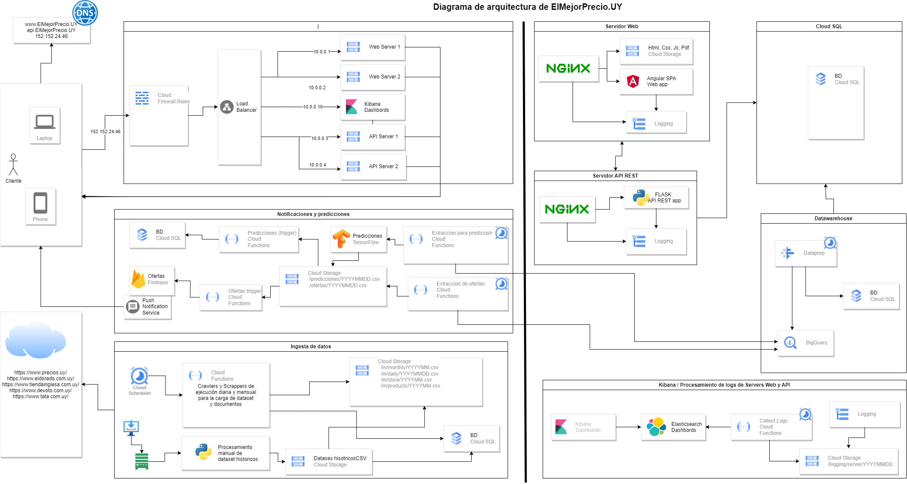

# Big Data Architecture - Big Data Machine Learning Bootcamp

## Diseño del DAaaS

### Definicion de la estrategia del DAaaS

Crear un aplicacion web spa que mejore el acceso de los consumidores a la información, favorecer el funcionamiento de los mercados minoristas, estimulando la competencia y optimizando el proceso de difusión de precios.
La aplicación permitirá buscar, visualizar y predecirá los precios de más de 200 productos en más de 500 establecimientos.
Adicionalmente notificará las ofertas por debabjo del percentil 10 diariamente a los suscriptores del servicio.

### Arquitectura DAaaS

Fuentes de datos
- Dataset de gobierno con los precios historicos desde 2007, [Licencia de DAG de Uruguay](https://www.gub.uy/agencia-gobierno-electronico-sociedad-informacion-conocimiento/sites/agencia-gobierno-electronico-sociedad-informacion-conocimiento/files/documentos/publicaciones/licencia_de_datos_abiertos_0.pdf)
  
- Crawler y Scrapper de las cadenas de establecimientos mas importarntes
  - https://www.devoto.com.uy/
  - https://tiendainglesa.com.uy/
  - https://www.tata.com.uy/
  - https://www.eldorado.com.uy/
Componentes
- Hadoop para procesamiento de datos
- Google Cloud Storage para ficheros de creawler, scrapper, dataset 
- Server de aplicacion Web
 - Aplicacion Angular SPA
- Server API REST en Python/Flask
- Load Balancer para la gestion de peticiones http
- Base de datos Google Cloud SQL
- Cloud Functions para scrappers y crawlers
- Cloud Scheduler para la ejecucion de tareas programadas
- DataPrep para las transformaciones de data para el Datawarehouse
- Big Query para Datawarehousing
- Firebase Cloud Messaging para las notificaciones push
  
### DAaas Operantion Model Design and Rollout
- Tareas por unica vez al inicio del proyecto
  - Crear y configurar un Google Cloud Project "El_Mejor_Precio_UY" con un bucket de Cloud Storage
  - Obtener los Datasets de establecimientos y productos
    - Descargar los archivos .csv desde https://www.precios.uy/
    - Crear Crawlwer y scraper de recopilacion de datos de establecimoento y productos futuros denominarlos CF_CR_SC_Stores y CF_CR_SC_Products
      - Estos script deberan dejar los resultados de su ejecucion en Cloud Storage en las carpetas y archivos con el siguiente formato  /in/store/YYYYMM.csv y /in/products/YYYYMM.csv respectivamente
    - Probar la ejecucion del programa para el procesamiento de los archivos
    - Subirlo como una Cloud function para su posterior ejecucion de actualizacion de datos
  - Obtener los Datasets historicos
    - Descargar los archivos .csv del sitio https://www.precios.uy/
    - Analizar y validar las estructuras de los mismo, normalizar los datos y generar el script para procesarlos
    - Procesar los archivos para generarar los scripts SQL de creacion de tablas e insercion de datos en Cloud Sql 
    - Subirlos a Google Cloud Storage para su posterior ejecucion manualmente
  - Crear la base de datos BD en Sql Cloud
  - Procesar los scripts generados on premise en la BD de SQL Cloud
    - de creación de tablas denominado scripts_01.1_creation_tables.sql
    - de la inserción de los datos historicos scripts_01.2_load_data.sql
  - Subir los scripts scripts_01.* a Google Cloud Storage en la carpeta /scripts_01_creation_load en caso de necesitar reprocesarlos datos
  - 
- Crear Crawlwer y scraper en Python de recopilacion de datos mensuales y subirlo como una Cloud function denomido CF_CR_SC_Monthly
  - El script debera dejar el resultado de su ejecucion en Cloud Storage en las carpetas y archivos con el siguiente formato /in/monthly/YYYYMM.csv
- Crear Crawlwer y scraper de recopilacion de datos diarios y subirlo como una Cloud function denominado CF_CR_SC_Daily
  - El script debera dejar el resultado de su ejecucion en Cloud Storage en las carpetas y archivos con el siguiente formato /in/daily/YYYYMMDD.csv
- Crear usuarios para ejecutar los Cloud functions y asignar los permisos correspondientes
- Configurar Cloud Scheduler para la ejecucion de las tareas programadas
  - Los scripts CF_CR_SC_Stores y CF_CR_SC_Products de recopilacion de datos de establecimientos y productos (planificacion mensual dias 1,3,5,7,10 hora 11 PM)
  - El script CF_CR_SC_Monthly de recopilacion de datos mensual (planificacion mensual dias 1,3,5,7,10 hora 11 PM)
  - El script CF_CR_SC_Daily de recopilacion de ofertas diario (planificacion diaria hora 9 AM) 
- Crear la base de datos BDW para Datawarehousing
- Configuracion de Dataprep para la generacion del Datawarehouse en BigQuery
-   Crear los jobs para la generacion de datos que seran usados para las predicciones, analisis, etc.
-   Probar la ejecucion de los jobs
-   Programar la ejecucion de los jobs
- Firebase
  - Crear la aplicacion y configurar las notificaciones
- Notificaciones
  - Crear los Cloud functions CF_Notifications
  - Programar la ejecucion de los jobs
  - Probar realizar el tunning de los jobs
- Predicciones
  - Crear los Cloud functions CF_Predicciones con los modelos de regresion linea y regresion logistica utilizando la API de Keras para tener una implementacion rapida y efectiva como un MVP de esta feature 
  - Programar la ejecucion de los jobs
  - Probar realizar el tunning de los jobs
    
    
### DAaas Diagram

  
  
  
  

